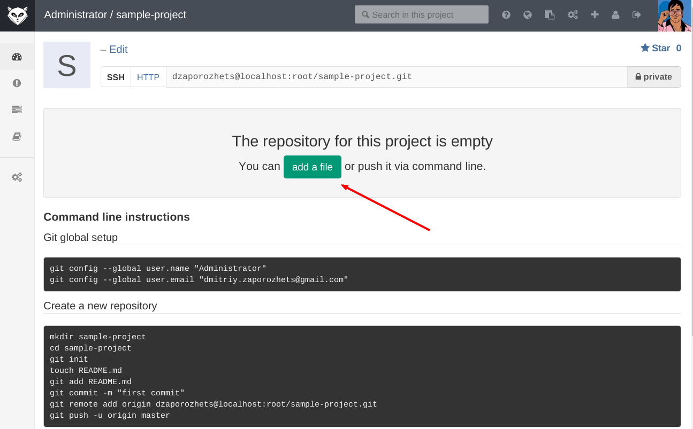
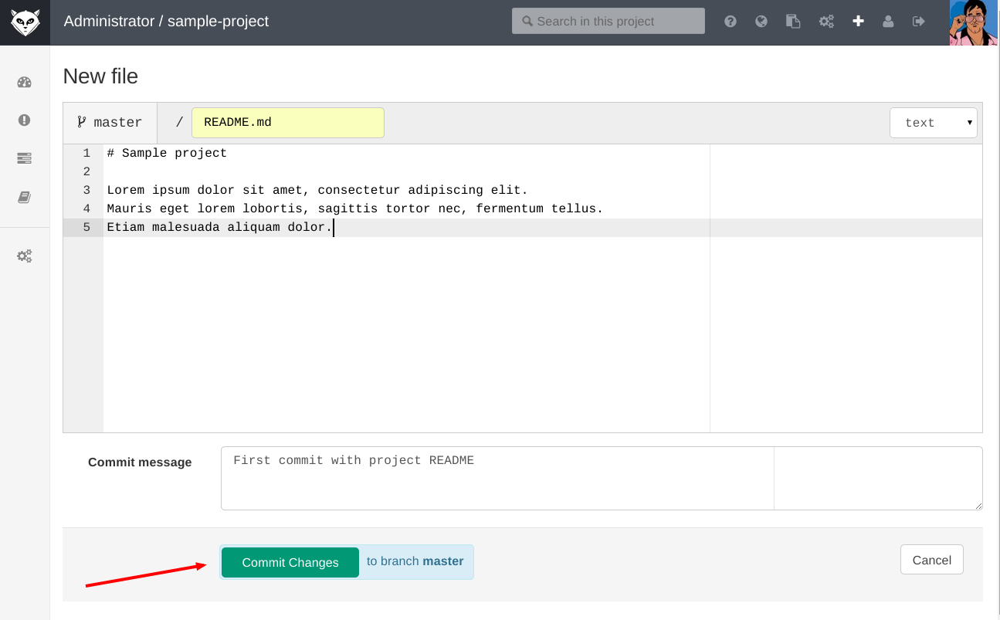
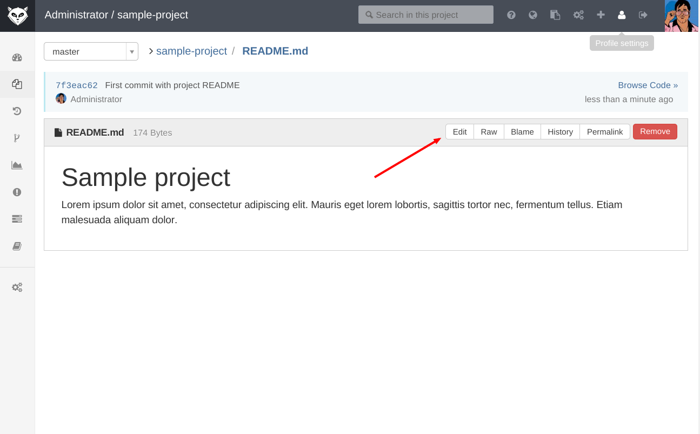
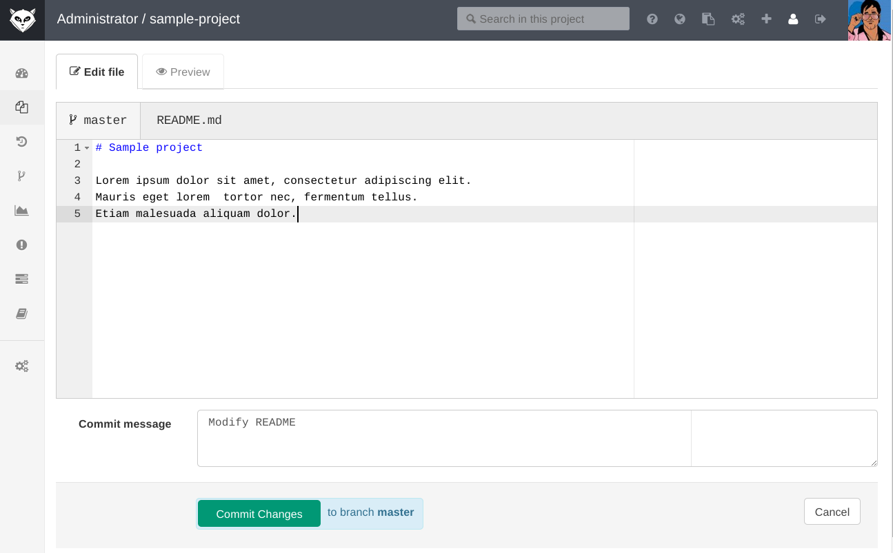

# GitLab Web Editor

In GitLab you can create new files and edit existing files using our web editor.
This is especially useful if you don't have access to a command line or you just want to do a quick fix.
You can easily access the web editor, depending on the context.
Let's start from newly created project.

Click on `Add a file`
to create the first file and open it in the web editor.

Fill in a file name, some content, a commit message, branch name and press the commit button.
The file will be saved to the repository.

You can edit any text file in a repository by pressing the edit button, when
viewing the file.

Editing a file is almost the same as creating a new file,
with as addition the ability to preview your changes in a separate tab. Also you can save your change to another branch by filling out field `branch`

