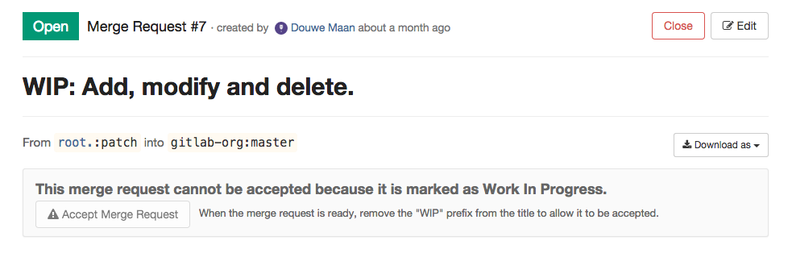
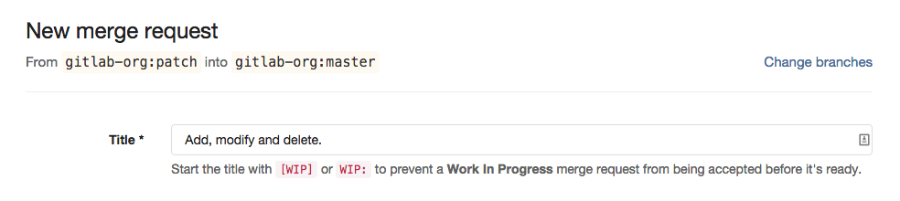
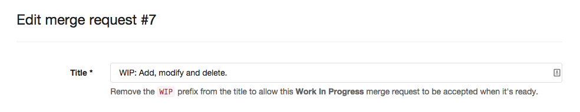

# "Work In Progress" Merge Requests

To prevent merge requests from accidentally being accepted before they're completely ready, GitLab blocks the "Accept" button for merge requests that have been marked a **Work In Progress**.

To mark a merge request a Work In Progress, simply start its title with `[WIP]` or `WIP:`.

To allow a Work In Progress merge request to be accepted again when it's ready, simply remove the `WIP` prefix.

